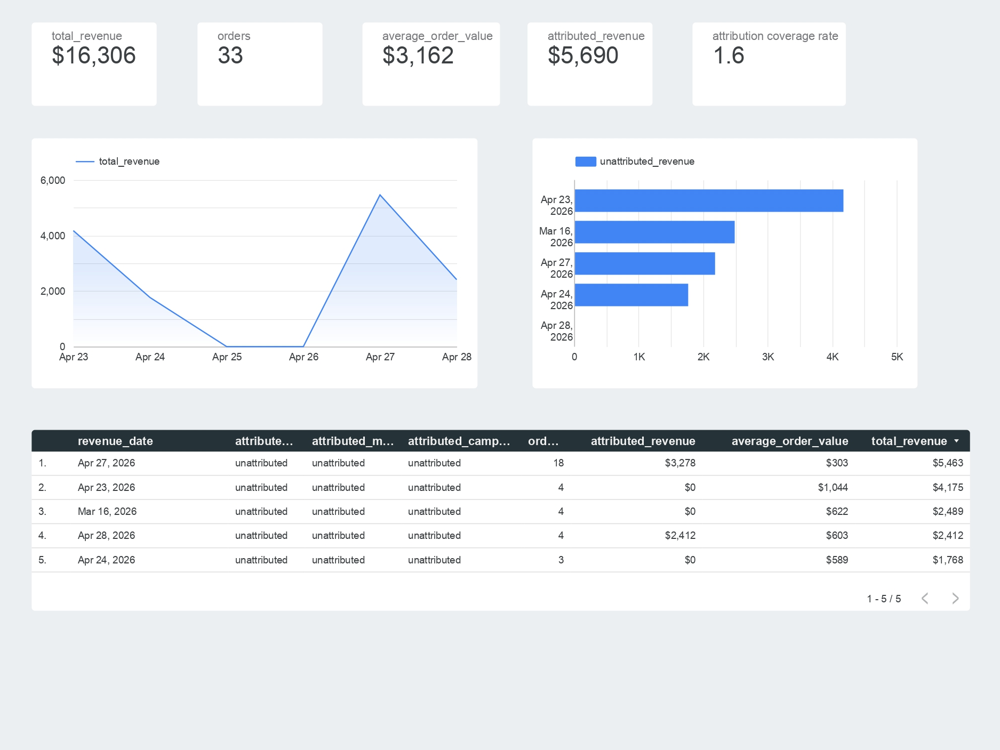
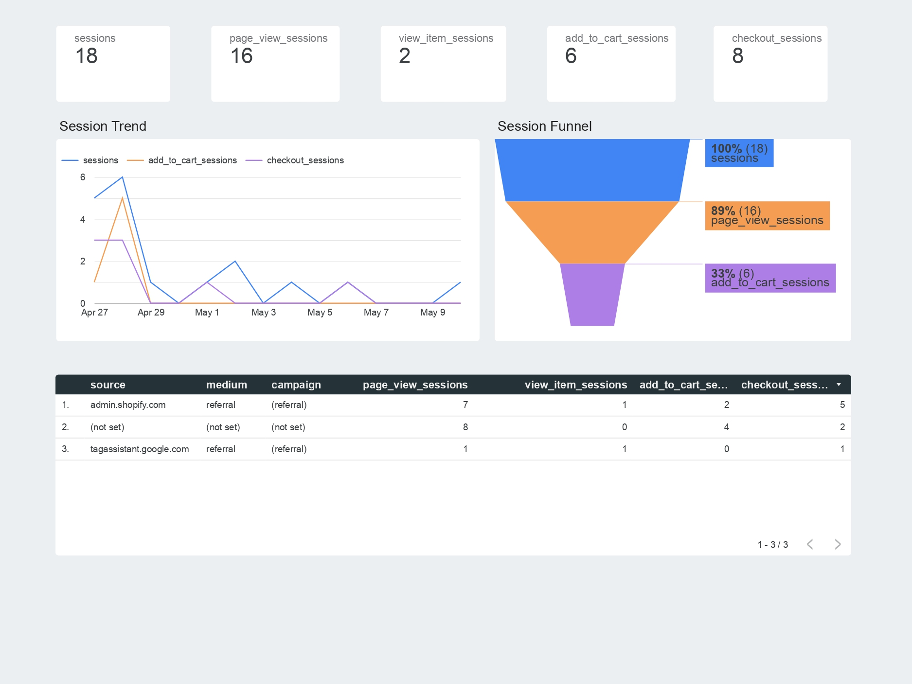
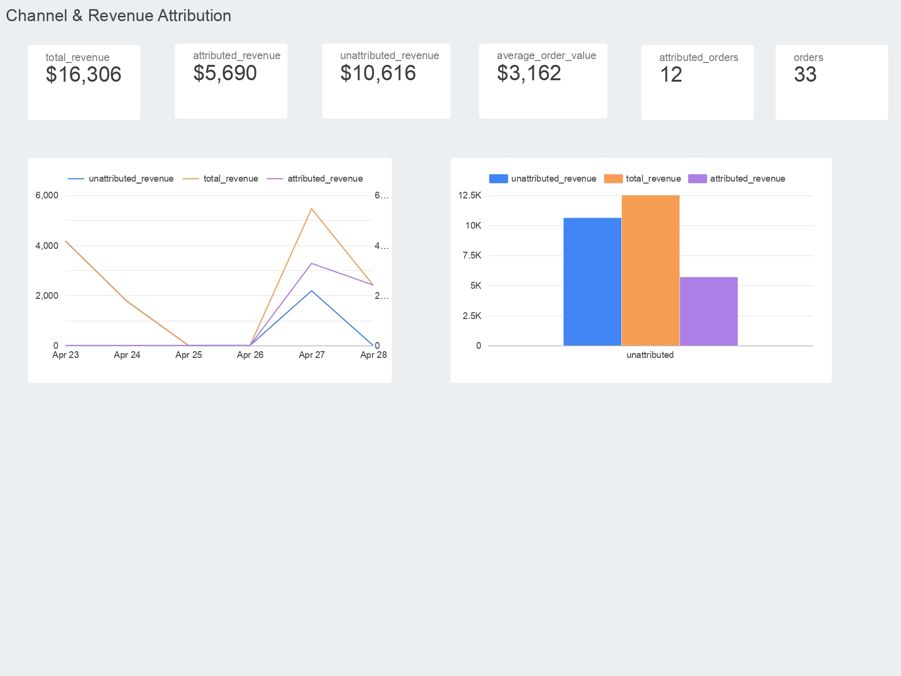
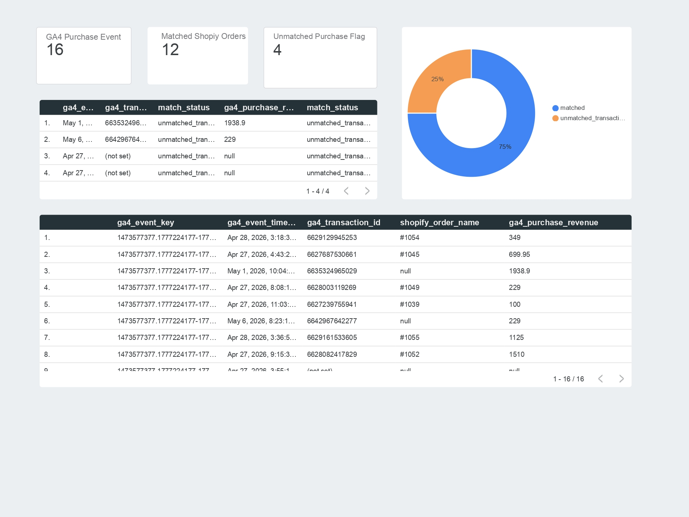

# Shopify + GA4: Full-Funnel Growth & Revenue Attribution Engine

This project combines Shopify commerce data with GA4 behavioral data to analyze the ecommerce path from traffic to revenue attribution:

```text
traffic -> behavior -> conversion -> revenue -> attribution
```

The goal is to build a learning-focused analytics system that shows what users do before they buy, whether GA4 purchase tracking reconciles to Shopify order truth, and which source / medium / campaign values are associated with real Shopify revenue.

Shopify is treated as the source of truth for orders and revenue. GA4 is used for behavioral events, sessions, ecommerce funnel activity, and purchase-session attribution.

Profitability, CAC, LTV, and embedded Shopify app work are intentionally out of scope for this project.

## Final Deliverable

The current project now includes:

- Python ingestion from Shopify Admin API into BigQuery raw tables.
- GA4 BigQuery export modeling.
- dbt staging, intermediate, and mart layers.
- GA4-to-Shopify purchase reconciliation.
- Session-based funnel reporting.
- Shopify-truth revenue facts.
- Purchase-session channel attribution.
- A Looker Studio dashboard built on top of the completed marts.

## Dashboard Preview

The dashboard contains four pages:

1. Executive Overview
2. Funnel Performance
3. Channel & Revenue Attribution
4. Reconciliation & Data Quality

### Executive Overview



### Funnel Performance



### Channel & Revenue Attribution



### Reconciliation & Data Quality



Dashboard notes and interpretation guidance are documented in [docs/dashboard_notes.md](docs/dashboard_notes.md).

## Business Questions

This project is designed to answer:

- Which channels and campaigns are associated with Shopify revenue?
- Where do users drop off before purchase?
- How many GA4 purchase events match Shopify orders?
- How much revenue is attributed vs unattributed?
- Which orders can be confidently tied to GA4 purchase-session attribution?
- Are the dbt marts reliable enough for BI reporting?

## Stack

- Python
- Shopify Admin API
- GA4 BigQuery export
- BigQuery
- dbt Fusion
- Looker Studio
- PowerShell / Windows local environment

Dagster orchestration is planned as future polish, but the current project scope is complete without it.

## Data Sources

### Shopify

Shopify raw data is ingested through Python scripts and stored in BigQuery as raw JSON payloads.

Current raw Shopify tables:

- `raw_shopify_orders`
- `raw_shopify_products`
- `raw_shopify_customers`

The ingestion flow supports:

- incremental loading using Shopify `updated_at`
- `pipeline_state` checkpointing
- local skipping of records at or before the previous checkpoint
- raw JSON payload retention for auditability

### GA4

GA4 data comes from the BigQuery daily export tables:

```text
analytics_534648282.events_YYYYMMDD
```

Important GA4 fields:

- `event_name`
- `event_timestamp`
- `event_date`
- `user_pseudo_id`
- `event_params`
- `items`

Important extracted event parameters:

- `ga_session_id`
- `ga_session_number`
- `page_location`
- `page_title`
- `source`
- `medium`
- `campaign`
- `currency`
- `transaction_id`
- `purchase_revenue`

## dbt Project

The dbt project lives in:

```text
shopify_ga4/
```

Main layers:

- `staging/ga4`
- `staging/shopify`
- `intermediate`
- `marts`
- `marts/growth`

## Completed Models

### Shopify Staging

- `stg_shopify__orders`
- `stg_shopify__order_line_items`
- `stg_shopify__customers`
- `stg_shopify__products`
- `stg_shopify__product_variants`

These models parse raw Shopify JSON into typed, analytics-ready tables. Shopify customer PII is intentionally not required for the current scope; `customer_id` is enough for order and future customer-level modeling.

### GA4 Staging

- `stg_ga4__events`
- `stg_ga4__sessions`
- `stg_ga4__purchases`
- `stg_ga4__items`

These models flatten GA4 event exports, extract key event parameters, sessionize behavior, and isolate ecommerce purchase and item-level records.

### Intermediate

- `int_ga4_shopify__purchase_reconciliation`
- `int_ga4_shopify__order_attribution`

`int_ga4_shopify__purchase_reconciliation` keeps one row per GA4 purchase event and compares GA4 purchases to Shopify orders.

Confirmed match rule:

```text
GA4 transaction_id = cast(Shopify order_id as string)
```

`int_ga4_shopify__order_attribution` moves attribution to one row per Shopify order while preserving unmatched Shopify orders as unattributed.

### Marts

- `fct__orders`
- `fct__order_lines`
- `fct__funnel`
- `fct__attributed_orders`
- `fct__channel_revenue`

`fct__orders` and `fct__order_lines` provide Shopify-truth revenue facts.

`fct__funnel` provides session-based funnel metrics by date and GA4 traffic dimensions.

`fct__attributed_orders` provides one attributed order row per Shopify order.

`fct__channel_revenue` aggregates Shopify revenue by revenue date, currency, source, medium, and campaign for dashboard reporting.

## Dashboard Pages

### Executive Overview

Purpose:

```text
Give a quick read on revenue, order volume, AOV, attribution coverage, and top channels.
```

Main model:

- `fct__channel_revenue`

Key metrics:

- total revenue
- orders
- average order value
- attributed revenue
- unattributed revenue
- revenue attribution coverage

### Funnel Performance

Purpose:

```text
Show how sessions move through product view, cart, checkout, and matched purchase behavior.
```

Main model:

- `fct__funnel`

Key metrics:

- sessions
- view item sessions
- add to cart sessions
- checkout sessions
- matched purchase sessions
- revenue per session
- session-to-purchase rate

This funnel is session-based. Step rates can exceed 100% when users enter mid-funnel, when purchases happen in later sessions, or when test/debug traffic does not follow a natural browsing path.

### Channel & Revenue Attribution

Purpose:

```text
Show Shopify-truth revenue by GA4 purchase-session attribution dimensions.
```

Main model:

- `fct__channel_revenue`

Key metrics:

- total revenue
- attributed revenue
- unattributed revenue
- attributed orders
- unattributed orders
- attribution coverage rates
- AOV by channel

Unattributed revenue is intentionally retained so totals reconcile to Shopify revenue.

### Reconciliation & Data Quality

Purpose:

```text
Audit how well GA4 purchase events match Shopify orders.
```

Main model:

- `int_ga4_shopify__purchase_reconciliation`

Key metrics:

- GA4 purchase events
- matched Shopify orders
- unmatched GA4 purchases
- invalid transaction IDs
- currency mismatches
- revenue differences
- purchase match rate

This page is the proof layer behind the attribution outputs.

## Known Data Limitations

The current dataset is primarily setup, debug, and manual test traffic. Because of that:

- many sessions have limited or unhelpful source / medium / campaign values
- sources such as `tagassistant`, `admin.shopify`, and `referral` appear in attribution outputs
- the funnel shape may not look like a normal production ecommerce funnel
- channel performance should be interpreted as pipeline validation, not production marketing performance

This limitation is expected for the current project. The model proves the ingestion, transformation, reconciliation, attribution, and dashboard pattern. Richer channel analysis would require cleaner production acquisition data with UTM standards and internal/test traffic exclusion.

## Current Project Structure

```text
.
|-- assets/
|   |-- Shopify_GA4_Funnel_Growth_&_Revenue_Attribution_page-0001.jpg
|   |-- Shopify_GA4_Funnel_Growth_&_Revenue_Attribution_page-0002.jpg
|   |-- Shopify_GA4_Funnel_Growth_&_Revenue_Attribution_page-0003.jpg
|   `-- Shopify_GA4_Funnel_Growth_&_Revenue_Attribution_page-0004.jpg
|-- docs/
|   `-- dashboard_notes.md
|-- ingestion/
|   |-- ingest_data.py
|   |-- run_shopify_ingestion.py
|   |-- shopify_client.py
|   `-- test.py
|-- shopify_ga4/
|   |-- dbt_project.yml
|   |-- profiles.yml
|   |-- packages.yml
|   `-- models/
|       |-- staging/
|       |-- intermediate/
|       `-- marts/
|-- TODO.md
`-- README.md
```

## Running Shopify Ingestion

Create a local `.env` file with the required credentials. Do not commit `.env`.

```env
SHOPIFY_STORE_URL=your-store.myshopify.com
SHOPIFY_API_VERSION=2025-01
SHOPIFY_CLIENT_ID=your_client_id
SHOPIFY_CLIENT_SECRET=your_client_secret

GCP_PROJECT_ID=your-gcp-project-id
BQ_DATASET=shopify_raw
```

Run ingestion from the repository root:

```powershell
.\.venv\Scripts\python.exe ingestion\run_shopify_ingestion.py
```

## Running dbt

Run from inside the `shopify_ga4` folder.

Build the main project:

```powershell
dbt run
```

Run tests:

```powershell
dbt test
```

Build the attribution chain:

```powershell
dbt run --select int_ga4_shopify__order_attribution+
```

Generate a dbt Fusion catalog:

```powershell
dbt compile --write-catalog
```

## Validation Status

Latest known status:

- Shopify ingestion is built and loads raw JSON into BigQuery.
- Shopify staging models build successfully.
- GA4 staging models build successfully.
- Purchase reconciliation model builds successfully.
- Funnel mart builds successfully.
- Revenue marts build successfully.
- Attribution models build successfully.
- Focused attribution tests passed.
- Dashboard pages were built in Looker Studio.

Known GA4 warnings are treated as data-quality signals rather than blockers.

## What I Learned

Key lessons from this project:

- Shopify should remain the source of truth for orders and revenue.
- GA4 is best used for behavior, session context, and attribution dimensions.
- Reconciliation should stay at GA4 purchase-event grain as proof.
- Attribution should move to Shopify order grain for revenue reporting.
- Unattributed revenue should be kept visible so revenue totals still reconcile.
- Session-based funnels can look unusual with test traffic or cross-session behavior.
- Raw nested ecommerce data needs careful staging before it is useful in BI.

## Future Project Ideas

The next project could build on this foundation with:

- stricter UTM naming standards
- internal/admin/test traffic exclusion
- source / medium normalization
- test order tagging
- first-touch and last-touch attribution
- product-level ecommerce analysis
- Dagster orchestration
- profitability, CAC, and LTV modeling
- embedded Shopify app exploration

Those ideas are intentionally kept out of the current project so this scope remains focused and explainable.
